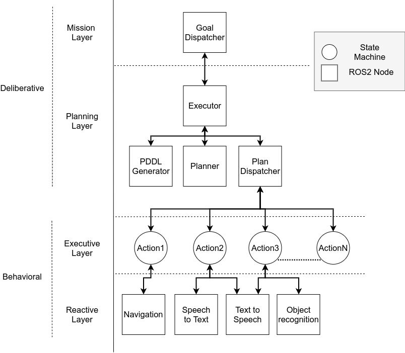

# merlin2



## Docker

### Update image
```shell
docker login niebla.unileon.es:5000 --username=<USER>
docker container commit cd8a975d2169 merlin2:v1
docker image tag merlin2:v1 niebla.unileon.es:5000/mgonzs/merlin2:v1
docker image push niebla.unileon.es:5000/mgonzs/merlin2:v1
```

### Run
```shell
docker pull mongo
docker run --shm-size=2g -e VNC_PASSWORD=vncpasswd -d --name=merlin2 --net=guacamole_guacnetwork_compose niebla.unileon.es:5000/mgonzs/merlin2:v1
docker run --shm-size=2g -e VNC_PASSWORD=vncpasswd -d --name=merlin2_kb --net=guacamole_guacnetwork_compose niebla.unileon.es:5000/mgonzs/merlin2:v1
docker run --shm-size=2g  -p 27017:27017 -e VNC_PASSWORD=vncpasswd -d --name=mmongodb --net=guacamole_guacnetwork_compose mongo
```


