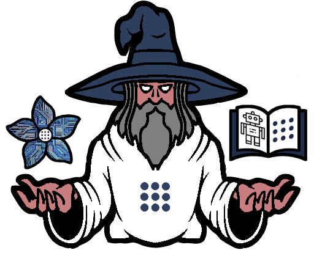
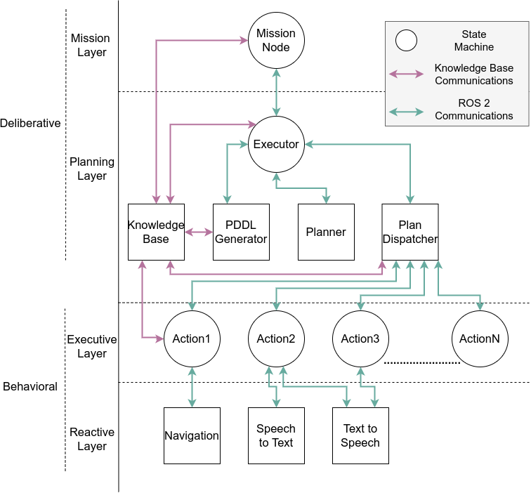

# MERLIN 2 (MachinEd Ros pLanINg)

<p align="center">
  
</p>

## Table of Contents
1. [Diagram](#diagrams)
2. [PDDL Planners](#pddl-planners)
3. [Installation](#installation)
4. [Creating new actions](#creating-new-actions)

   4.1. [PDDL Example](#pddl-example)

   4.2. [MERLIN2 Example](#merlin2-example)

   4.3. [MERLIN2 State Machine Example](#merlin2-state-machine-example)

5. [Demos](#demos)
6. [Citations](#citations)

## Diagram

<p align="center">
  
</p>

## PDDL Planners

- [POPF](https://planning.wiki/ref/planners/popf)
- [SMTPlan+](https://planning.wiki/ref/planners/smtplan)
- [unified-planning](https://github.com/aiplan4eu/unified-planning)
- [VHPOP](https://github.com/hlsyounes/vhpop)

## Installation

```shell
# clone these repos
$ cd ~/ros2_ws/src
$ git clone --recurse-submodules https://github.com/MERLIN2-ARCH/merlin2.git
$ cd merlin2

# SMTPlan+ dependencies
$ sudo apt install libz3-dev -y

# unified-planning
$ pip3 install --pre unified-planning[pyperplan,tamer]

# MongoDB
$ sudo ./scrips/install_mongo.sh
$ sudo ./scrips/install_mongocxx.sh

# sst
$ sudo apt-get install -y python-dev libportaudio2 libportaudiocpp0 portaudio19-dev libasound-dev swig
$ python3 merlin2_arch/merlin2_reactive_layer/speech_to_text/nltk_download.py

# tts
$ sudo apt install espeak -y
$ sudo apt install speech-dispatcher -y
$ sudo apt install festival festival-doc festvox-kdlpc16k festvox-ellpc11k festvox-italp16k festvox-itapc16k -y
$ sudo apt install mpg321 -y

# pip3
$ pip3 install -r requirements.txt

# colcon
$ cd ~/ros2_ws
$ colcon build
```

## Creating new actions

The creation of a new action is presented in this section. This way, navigation action is presented in PDDL, MERLIN2 and MERLIN2 state machine.

### PDDL Example

This PDDL example shows a durative action that moves a robot from an origin (o) to a destination (d). It has two parameters o and d of type wp (waypoint), one condition, which is that the robot has to be at the origin, and two effects, which are that the robot is not at the origin but is at the destination.

```pddl
(:durative-action navigation
  :parameters (?o ?d - wp)
  :duration (= ?duration 10)
  :condition (and
    (at start (robot_at ?o))
  )
  :effect (and
    (at start (not (robot_at ?o)))
    (at end (robot_at ?d))
  )
)
```

### MERLIN2 Example

This [example](./merlin2_arch/merlin2_executive_layer/merlin2_basic_actions/merlin2_basic_actions/merlin2_navigation_action.py) presents the same PDDL durative action as the previous PDDL version but using MERLIN2. There are 5 methods to override:

- **run_action**: this callback is used to execute the code of the action.
- **cancel_action**: this callback is used to cancel the action execution.
- **create_parameters**: this method is used to return the list of parameters of the action (PddlObjectDto).
- **create_conditions**: this method is used to return the list of conditions of the action (PddlConditionEffectDto).
- **create_effects**: this method is used to return the list of effects of the action (PddlConditionEffectDto).

```python
from typing import List
import rclpy

from kant_dto import (
    PddlObjectDto,
    PddlConditionEffectDto,
)

from merlin2_basic_actions.merlin2_basic_types import wp_type
from merlin2_basic_actions.merlin2_basic_predicates import robot_at

from merlin2_action.merlin2_action import Merlin2Action

from waypoint_navigation_interfaces.action import NavigateToWp
from merlin2_arch_interfaces.msg import PlanAction


class Merlin2NavigationAction(Merlin2Action):

    def __init__(self):

        # create PDDL parameters as PddlObjectDto
        self.__org = PddlObjectDto(wp_type, "o")
        self.__dst = PddlObjectDto(wp_type, "d")

        # super init
        super().__init__("navigation")

        # ROS 2 interfaces
        self.__wp_nav_client = self.create_action_client(
            NavigateToWp, "/waypoint_navigation/navigate_to_wp")

    # override the run callback
    def run_action(self, goal: PlanAction) -> bool:
        nav_goal = NavigateToWp.Goal()

        dst = goal.objects[1]
        nav_goal.wp_id = dst

        self.__wp_nav_client.wait_for_server()
        self.__wp_nav_client.send_goal(nav_goal)
        self.__wp_nav_client.wait_for_result()

        if self.__wp_nav_client.is_succeeded():
            return True

        else:
            return False

    # override cancel callback
    def cancel_action(self):
        self.__wp_nav_client.cancel_goal()

    # add PDDL parameters
    def create_parameters(self) -> List[PddlObjectDto]:
        return [self.__org, self.__dst]

    # add PDDL action conditions as PddlConditionEffectDto
    def create_conditions(self) -> List[PddlConditionEffectDto]:
        condition_1 = PddlConditionEffectDto(robot_at,
                                             [self.__org],
                                             time=PddlConditionEffectDto.AT_START)
        return [condition_1]

    # add PDDL action effects as PddlConditionEffectDto
    def create_efects(self) -> List[PddlConditionEffectDto]:
        effect_1 = PddlConditionEffectDto(robot_at,
                                          [self.__dst],
                                          time=PddlConditionEffectDto.AT_END)

        effect_2 = PddlConditionEffectDto(robot_at,
                                          [self.__org],
                                          is_negative=True,
                                          time=PddlConditionEffectDto.AT_START)

        return [effect_1, effect_2]


def main(args=None):
    rclpy.init(args=args)
    node = Merlin2NavigationAction()
    node.join_spin()
    rclpy.shutdown()

if __name__ == "__main__":
    main()
```

### MERLIN2 State Machine Example

This [example](./merlin2_arch/merlin2_executive_layer/merlin2_basic_actions/merlin2_basic_actions/merlin2_navigation_fsm_action.py) presents the same PDDL durative action as the previous one but using state machines. In this version, the action is built using states. run_action and cancel_action methods are not necessary because the execution depends on the execution of the state machine. This means that run_action executes the state machine and cancel_action stops the state machines, stopping the current state, transparently for the user.

There are some basics states that can be accessed from [Merlin2BasicStates](./merlin2_arch/merlin2_executive_layer/merlin2_fsm_action/merlin2_fsm_action/merlin2_state_factory/merlin2_basic_states.py), but new ones can be implemented using the state classes from YASMIN. The basic states are:

- NAVIGATION
- TTS
- STT

```python
from typing import List
import rclpy

from kant_dto import (
    PddlObjectDto,
    PddlConditionEffectDto,
)

from merlin2_basic_actions.merlin2_basic_types import wp_type
from merlin2_basic_actions.merlin2_basic_predicates import robot_at

from merlin2_fsm_action import (
    Merlin2FsmAction,
    Merlin2BasicStates
)
from yasmin import CbState
from yasmin.blackboard import Blackboard


class Merlin2NavigationFsmAction(Merlin2FsmAction):

    def __init__(self):

        # create PDDL parameters as PddlObjectDto
        self.__org = PddlObjectDto(wp_type, "o")
        self.__dst = PddlObjectDto(wp_type, "d")

        # super init
        super().__init__("navigation")

        # YASMIN CbState to create the navigation goal
        prepare_goal_state = CbState(["valid"], self.prepapre_goal)

        # YASMIN state for navigation
        navigation_state = self.create_state(Merlin2BasicStates.NAVIGATION)

        # create state machine adding states
        self.add_state(
            "PREPARING_GOAL",
            prepare_goal_state,
            {"valid": "NAVIGATING"}
        )

        self.add_state(
            "NAVIGATING",
            navigation_state
        )

    # callback for YASMIN CbState
    def prepapre_goal(self, blackboard: Blackboard) -> str:
        blackboard.destination = blackboard.merlin2_action_goal.objects[1]
        return "valid"

    # add PDDL parameters
    def create_parameters(self) -> List[PddlObjectDto]:
        return [self.__org, self.__dst]

    # add PDDL action conditions as PddlConditionEffectDto
    def create_conditions(self) -> List[PddlConditionEffectDto]:
        condition_1 = PddlConditionEffectDto(robot_at,
                                             [self.__org],
                                             time=PddlConditionEffectDto.AT_START)
        return [condition_1]

    # add PDDL action effects as PddlConditionEffectDto
    def create_efects(self) -> List[PddlConditionEffectDto]:
        effect_1 = PddlConditionEffectDto(robot_at,
                                          [self.__dst],
                                          time=PddlConditionEffectDto.AT_END)

        effect_2 = PddlConditionEffectDto(robot_at,
                                          [self.__org],
                                          is_negative=True,
                                          time=PddlConditionEffectDto.AT_START)

        return [effect_1, effect_2]


def main(args=None):
    rclpy.init(args=args)
    node = Merlin2NavigationFsmAction()
    node.join_spin()
    rclpy.shutdown()


if __name__ == "__main__":
    main()
```

## Demos

These demos are tested with [ros2_rb1](https://github.com/mgonzs13/ros2_rb1) simulation.

### Demo 1

This a navigation, STT, TTS demo using the RB1 robot.

```shell
$ ros2 launch rb1_gazebo gazebo_nav2.launch.py
$ ros2 launch merlin2_demo merlin2_demo.launch.py
```

### Demo 2

The RB1 robot will start driving to specific points in the world. Half of the goals are canceled randomly. Distance and time are saved in a CSV file.

```shell
$ ros2 launch rb1_gazebo granny.launch.py
$ ros2 launch merlin2_demo merlin2_demo2.launch.py
```

<p align="center">
  
</p>

## Citations

```bibtex
@article{gonzalez2020merlin,
  title={MERLIN a cognitive architecture for service robots},
  author={Gonz{\'a}lez-Santamarta, Miguel {\'A} and Rodr{\'\i}guez-Lera, Francisco J and {\'A}lvarez-Aparicio, Claudia and Guerrero-Higueras, {\'A}ngel M and Fern{\'a}ndez-Llamas, Camino},
  journal={Applied Sciences},
  volume={10},
  number={17},
  pages={5989},
  year={2020},
  publisher={MDPI}
}
```
