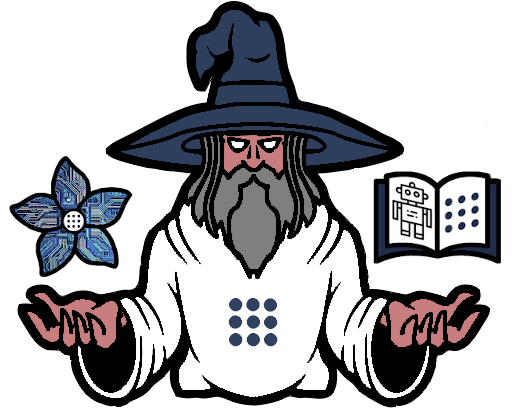
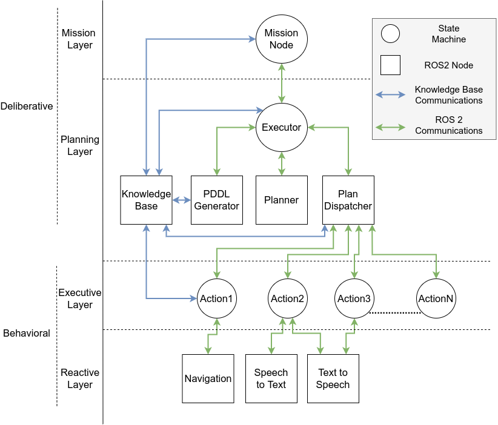

# MERLIN 2 (MachinEd Ros pLanINg)

<p align="center">
  
</p>

## Table of Contents

1. [Features](#features)
2. [Installation](#installation)
   - [Planners](#planners)
   - [MERLIN2](#merlin2)
3. [Knowledge Base](#knowledge-base)
4. [Demos](#demos)

## Features



## Installation

### Planners

#### SMTPlan+

```shell
$ sudo apt install libz3-dev
```

#### Unified Planning

```shell
# UP
$ git clone git@github.com:aiplan4eu/unified-planning.git
$ sudo pip3 install unified-planning/

# up-tamer
$ git clone https://github.com/aiplan4eu/up-tamer
$ sudo pip3 install up-tamer/

# up-pyperplan
$ git clone https://github.com/aiplan4eu/up-pyperplan
$ sudo pip3 install up-pyperplan/
```

### MERLIN2

```shell
$ cd ~/ros2_ws/src
$ git clone --recurse-submodules ssh://git@niebla.unileon.es:5022/mgonzs/merlin2.git
$ sudo pip3 install tqdm

# check packages installation
# KANT, YASMIN, simple_node

$ cd ~/ros2_ws
$ colcon build
```

## Demos

This demo is tested with [ros2_rb1](https://github.com/mgonzs13/ros2_rb1) world. The RB1 robot will start driving to specific points in the world. Half of the goals are canceled randomly. Distance and time are saved in a CSV file.

```shell
$ ros2 launch rb1_gazebo granny.launch.py
$ ros2 launch merlin2_demo merlin2_demo2_launch.py
```
