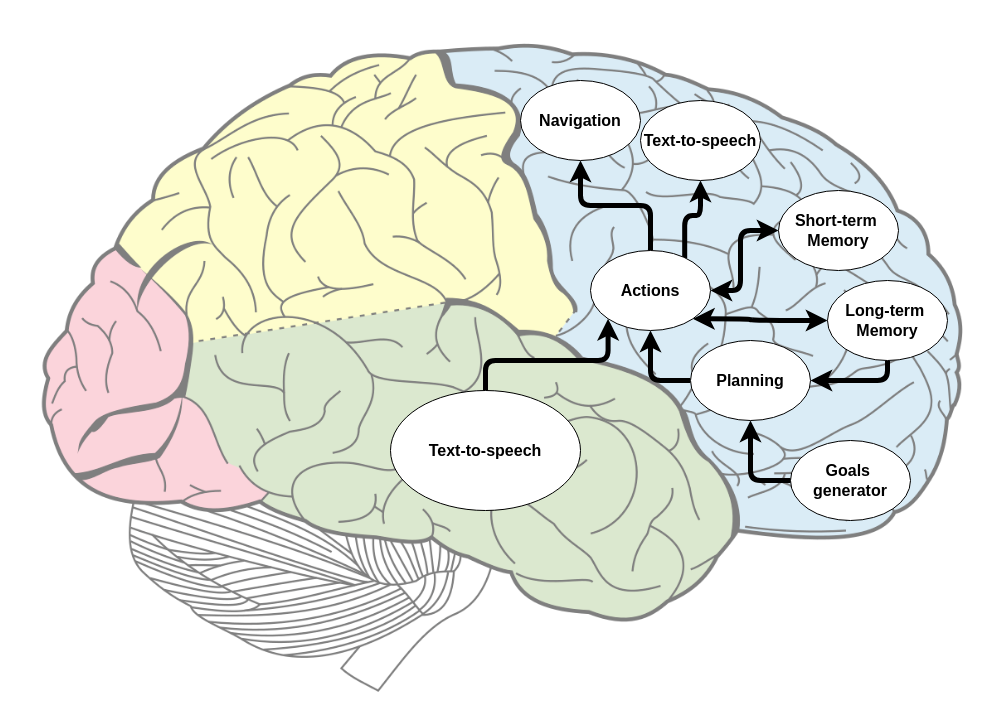

# MERLIN 2 (MachinEd Ros pLanINg)

<p align="center">
  
</p>

## Table of Contents

1. [Diagrams](#diagrams)
2. [Planners](#planners)
3. [Installation](#installation)
4. [Demos](#demos)

## Diagrams

<p float="left">
  
   
</p>

## Planners

- [POPF](https://planning.wiki/ref/planners/popf)
- [SMTPlan+](https://planning.wiki/ref/planners/smtplan)
- [unified-planning](https://github.com/aiplan4eu/unified-planning)
- [VHPOP](https://github.com/hlsyounes/vhpop)

## Installation

```shell

# SMTPlan+
$ sudo apt install libz3-dev

# unified-planning
$ pip install --pre unified-planning[pyperplan,tamer]

$ cd ~/ros2_ws/src
$ git clone --recurse-submodules ssh://git@niebla.unileon.es:5022/mgonzs/merlin2.git
$ cd merlin2
$ pip3 install -r requirements.txt

# check packages installation
# KANT, YASMIN, simple_node,
# merlin2_reactive_layer pacakges

$ cd ~/ros2_ws
$ colcon build
```

## Demos

This demo is tested with [ros2_rb1](https://github.com/mgonzs13/ros2_rb1) world. The RB1 robot will start driving to specific points in the world. Half of the goals are canceled randomly. Distance and time are saved in a CSV file.

```shell
$ ros2 launch rb1_gazebo granny.launch.py
$ ros2 launch merlin2_demo merlin2_demo2.launch.py
```
